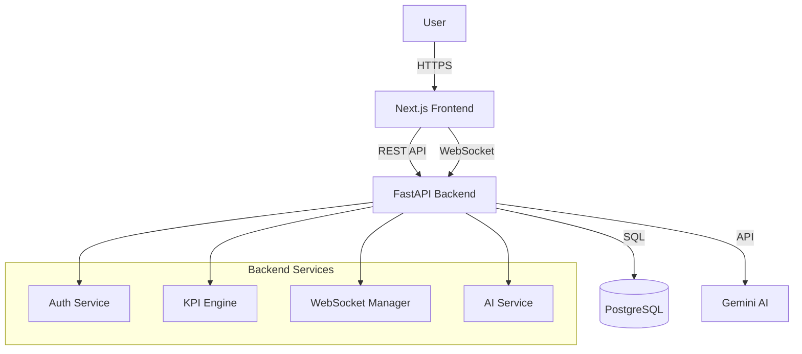

# System Architecture

## Overview
The Data Analysis Intelligence Platform follows a modern, decoupled architecture separating the frontend user interface from the backend data processing and AI services.

## High-Level Diagram

## Data Flow

1. **Ingestion**: Transactional data is stored in PostgreSQL.
2. **Processing**: `KPI Service` aggregates raw data into meaningful metrics (Revenue, AOV).
3. **Streaming**: `WebSocket Manager` pushes updates to connected clients every 30 seconds.
4. **Intelligence**: 
   - `AI Service` queries aggregated KPIs.
   - Formats a prompt for Gemini.
   - Parses the JSON response and stores it in the `ai_insights` table.
   - Frontend fetches or receives these insights.

## Security
- **Authentication**: JWT (JSON Web Tokens) for stateless session management.
- **Authorization**: Role-based access control (RBAC) ensuring only Admins can trigger costly AI generation.
- **Environment**: Sensitive keys (DB credentials, API keys) are managed via `.env` files.
